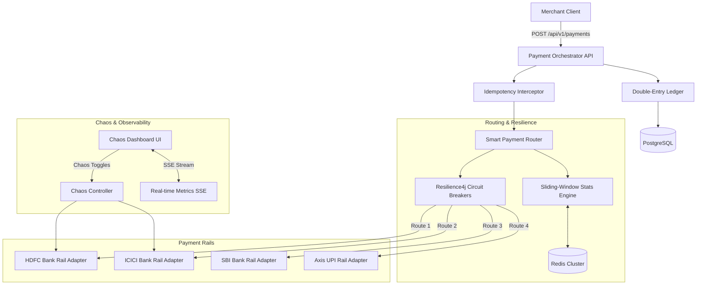

# System Architecture Overview

```mermaid
flowchart TD
    Merchant[Merchant Client] -->|POST /api/v1/payments| API[Payment Orchestrator API]
    API --> Idempotency[Idempotency Interceptor]
    Idempotency --> Router[Smart Payment Router]
    
    subgraph Routing & Resilience
        Router --> CB[Resilience4j Circuit Breakers]
        Router --> Stats[Sliding-Window Stats Engine]
        Stats <--> Redis[(Redis Cluster)]
    end
    
    subgraph Payment Rails
        CB -->|Route 1| HDFC[HDFC Bank Rail Adapter]
        CB -->|Route 2| ICICI[ICICI Bank Rail Adapter]
        CB -->|Route 3| SBI[SBI Bank Rail Adapter]
        CB -->|Route 4| AXIS[Axis UPI Rail Adapter]
    end
    
    API --> Ledger[Double-Entry Ledger]
    Ledger --> PG[(PostgreSQL)]
    
    subgraph Chaos & Observability
        Frontend[Chaos Dashboard UI] -->|Chaos Toggles| ChaosAPI[Chaos Controller]
        ChaosAPI --> HDFC
        ChaosAPI --> ICICI
        Frontend <-->|SSE Stream| MetricsSSE[Real-time Metrics SSE]
    end
```
